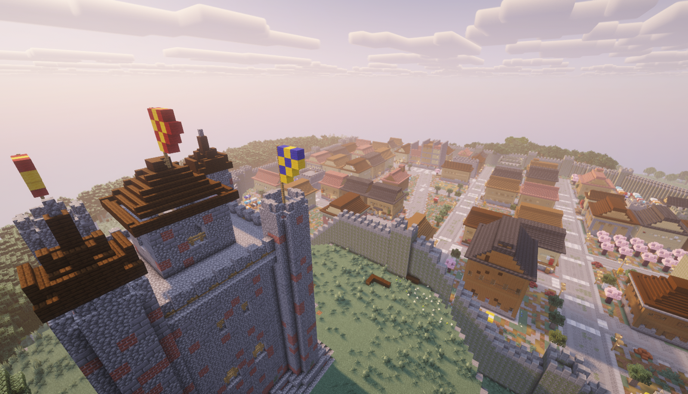

# Terrainist

Describe a world in a sentence, get a Minecraft world you can walk through.

<a href="https://x.com/pikalover6_"></a>

<p align="center">
  
</p>

Terrainist takes a text prompt, has a language model plan a world from it —
the terrain, the climate, the forests, the roads, and every building, ruin,
ship or statue by name and place — and then builds that plan into a Minecraft
Java world (1.21.11) with a deterministic compiler. The model decides *what*
the world is; the compiler decides *how* to build it, the same way every time.

More prompts and what came out of them are in [`gallery/`](gallery/).

## Quick start

You need Node 22 or newer and an API key for an OpenAI-compatible chat API.
OpenRouter is the default; OpenAI or a local server such as Ollama or vLLM
work the same way.

```sh
git clone https://github.com/pikalover6/terrainist.git
cd terrainist
npm install
npm run build

echo 'TERRAINIST_API_KEY=your-key' > .env

npx terrainist generate "a fishing village of stilt houses on a cold northern fjord" --install
```

That writes the world under `out/`, copies it into your Minecraft saves folder,
and it shows up in the world list the next time you open the game.

Prefer a page over a terminal? `npx terrainist ui` serves one at
http://localhost:4747: type a prompt, watch the log, install with a button.

## Configuration

Three settings, read from the environment or from `.env` in the repo root:

| setting | meaning | default |
| --- | --- | --- |
| `TERRAINIST_API_KEY` | your API key (`OPENROUTER_API_KEY` also works) | — |
| `TERRAINIST_API_BASE` | the chat API's root URL | `https://openrouter.ai/api/v1` |
| `TERRAINIST_MODEL` | the model to ask | `google/gemini-3.8-flash` |

Requests use the standard OpenAI chat-completions shape, including
`reasoning_effort`, so any server that speaks it is a drop-in.

## Commands

```sh
terrainist generate "<prompt>"   # prompt → world (see --help for --seed, --model, --effort, --install …)
terrainist compile <file>        # build a world from a saved plan, no model call
terrainist install <worldDir>    # copy a world into a saves folder; never overwrites a save
terrainist ui                    # the local web page
terrainist kit                   # the language reference the model writes against
terrainist catalog               # every building and prop the compiler can build
```

Every command answers `--help`. Run them as `npx terrainist …` from the repo,
or add `node_modules/.bin` to your `PATH`.

Useful things to know about `generate`:

- The seed is derived from the prompt, so the same words give the same world.
  Pass `--seed N` for a different one.
- The plan the model wrote is kept beside the world as `<name>.loam.json`.
  `terrainist compile` rebuilds it without another model call, and you can
  edit it by hand: the format is small and `terrainist kit` documents all of it.
- If the model's first answer was rejected by the validator, every rejected
  reply is kept as `<name>.authoring.json` so you can see what went wrong.
- Minecraft's default saves folder is used for `--install`; pass `--saves` for
  a launcher that keeps its own instance folders.

## How it works

1. A cheap model call classifies the prompt: era, wealth, climate, character.
2. The model writes the plan in **Loam**, a small JSON language: the land
   (ridges, peaks, valleys, rivers, basins…), the climate and woods, the
   roads, and a list of *things*. A thing is a building from the catalog, a
   plaza, district or city, a farm, airport or harbour, or anything new with a
   short brief, placed by relations like *near*, *facing*, *on the ridge*,
   *along the shore* rather than coordinates. Anything the catalog cannot
   build gets its own small program written by the model and verified before
   it is used.
3. The compiler builds it: terrain, settlement layout, ground works, buildings
   and props, vegetation, then validation and Minecraft region files.

| package | |
| --- | --- |
| `packages/spec` | the Loam language: vocabulary, validation, lowering |
| `packages/stdlib` | the catalog of buildings, props and styles; noise; terrain edits |
| `packages/compiler` | the world compiler |
| `packages/agents` | the model calls |
| `packages/cli` | the command and the web page |

## Development

```sh
npm test                       # the whole suite; compiles many worlds, so:
NODE_OPTIONS=--max-old-space-size=8192 npx vitest run --maxWorkers=4
npm run kit                    # regenerate the language reference after changing the catalog
```

## License

MIT.
